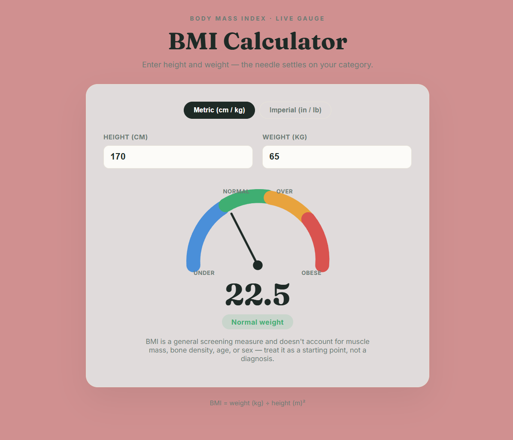

# BMI Calculator

A Body Mass Index (BMI) calculator with a live, animated gauge needle. Supports both Metric (cm/kg) and Imperial (in/lb) units, calculates BMI in real time, and categorizes the result with a color-coded arc gauge.

## Features
- Toggle between Metric and Imperial units
- Real-time BMI calculation as you type
- Animated gauge needle that settles on the calculated BMI
- Color-coded category arc: Underweight, Normal, Overweight, Obese
- Displays category label and explanatory note

## Formula Used
BMI = weight (kg) / height (m)²

## Tech Stack
- HTML5
- CSS3
- Vanilla JavaScript (real-time input handling, SVG/CSS gauge animation)

## How to Run
1. Clone the repo
2. Open `index.html` in any browser
   or
3. View the live demo: [Live Demo](your-github-pages-link)

## Screenshot

